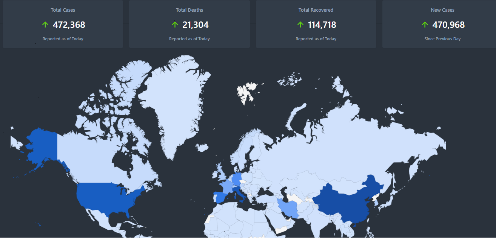

# Coronavirus Tracker
Coronavirus tracker for web with chart.

## Demo
https://coronavirus-track.herokuapp.com/

## Features
* __Live data__: Shows the most recent data, and updates automatically.
* __GeoChart__:
   * __Current state chart__ for all countries.
* __Search__ for countries.
* __Statistics__: Including the number of confirmed, recovered, and deaths, in addition to percents.

### Data
Data is provided by JHU CSSE (https://github.com/CSSEGISandData/COVID-19).

### Template
* [Appzia](https://themesdesign.in/appzia/index.html): Admin template.

### Libraries
* [Codeigniter](https://github.com/bcit-ci/CodeIgniter): Open Source PHP Framework.
* [GeoChart](https://developers.google.com/chart/interactive/docs/gallery/geochart): Show a map of a country, continent, or region.

## Contribute
Please feel free to contribute pull requests or create issues for bugs and feature requests.

